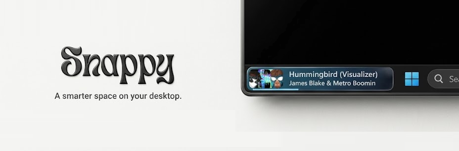

<p align="center">
  
</p>

<p align="center">
  <b>The empty corner of your taskbar, finally put to work.</b><br>
  What's playing, what's connected, what you just dragged in. All in one tiny, beautiful space.
</p>

<p align="center">
  
  
  
  
</p>

<!-- Tip: a short GIF of the dock in action goes great right here. -->

---

## Your taskbar has room to spare

On Windows 11 the left end of the taskbar sits empty. **Snappy lives there.** It's a slim dock that shows only what matters right now, then gets out of your way.

No window to manage. No icon to click. It's just there when you glance down.

## Meet the tabs

Scroll over the dock to flip between tabs. Tiny dots show where you are.

Music, Devices and Files appear on their own when they have something to show. At the very top is an **empty tab** that shows nothing at all, a clean taskbar whenever you want one. At the bottom, **Timer** and **System** are always there but never pushy: music starting won't pull you off your timer.

### 🎵 Music
Whatever's playing, front and centre. Spotify, a browser tab, anything that shows up in Windows' media controls.

- The cover art shows at its true shape, and a progress line takes its colour from the cover.
- Hover for **previous, play/pause and next**.
- A new track gets a moment: the cover sits alone, then the title slides out from behind it as the dock springs open.

### 🎧 Devices
Every connected Bluetooth device, with a **battery gauge that fills like water in a glass**.

- Connect your earbuds and you get a quick *Connected* note. Turn them off and you get *Disconnected*. Then the dock goes right back to what you were doing.

### 📎 Files
A drop shelf for the things you need in a minute.

- **Drag anything over the dock** (a file, a folder, an image, a snippet of text) and it jumps to a *Drop to Snappy* target, whichever tab you were on.
- Swipe back to the shelf whenever you like and **drag it straight back out**.
- Tap the three dots for **Remove, Copy path, Copy file**, in a full-width row, because the dock is small and you shouldn't have to aim.

### ⏱ Timer
A **Pomodoro** or a plain **countdown**, with a gauge that drains like water as the time runs down.

- Pomodoro runs 25 minutes of focus and 5 of break, with a longer break every fourth round. Breaks start by themselves; the next focus waits for you.
- Switch to a countdown and step it through 1, 2, 3, 5, 10, 15, 20, 25, 30, 45, 60 or 90 minutes.
- It keeps running while you're on another tab, and its dot stays green so you know. When a phase ends the dock turns **glowing orange-red, shakes like jelly and beeps until you press Stop** (a Pomodoro break only starts once you do).

### 📊 System
CPU and memory as liquid gauges (the water turns red when things run hot), plus live network speed.

- It only measures while the tab is on screen, so it costs nothing the rest of the time.

## Feels like part of Windows

- **Doesn't steal focus.** It never takes your keyboard from what you're working in.
- **Gets out of the way.** Start a game, a video or a presentation and it hides, then comes back when you're done.
- **Springy, smooth, minimal.** The dock stretches to fit its content and settles with a little bounce.
- **Light on your machine.** Roughly 1 to 3% of a single CPU core at rest, with every animation measured, not guessed.
- **Private by design.** Everything runs locally. No network access, no telemetry, no account.

## Try it

You'll need Windows 10/11 and [Node.js](https://nodejs.org) 18 or newer.

```bash
npm install
npm start
```

The first install downloads Electron, so give it a minute. Snappy appears at the left end of your taskbar. Press `Ctrl+Alt+Q` to quit.

> **Tip:** it assumes the Windows 11 default of centred taskbar icons. With left-aligned icons it would sit on top of them.

---

<details>
<summary><b>Under the hood</b></summary>

<br>

Built with Electron and plain JavaScript and CSS: no framework, no bundler, no native modules. The only dependency is Electron itself.

Electron can't see most of this on its own, so three small PowerShell scripts in [`scripts/`](scripts) watch Windows and report back one JSON line per change. The main process starts them, forwards what they print to the page over IPC, and they exit by themselves if Snappy does.

| Script | Windows API | Used for |
| --- | --- | --- |
| [`fullscreen-watch.ps1`](scripts/fullscreen-watch.ps1) | `SHQueryUserNotificationState` | Hiding the dock while something is full-screen |
| [`bluetooth-watch.ps1`](scripts/bluetooth-watch.ps1) | PnP device properties (`IsConnected`, battery level) | Which devices are connected, and their battery |
| [`media-watch.ps1`](scripts/media-watch.ps1) | WinRT `GlobalSystemMediaTransportControlsSessionManager` | Track, artwork, play state, and the play/pause/next/previous commands |
| [`network-watch.ps1`](scripts/network-watch.ps1) | .NET `NetworkInterface` statistics | Network speed (only runs while the System tab is open) |

Dropped files are only *referenced*, never copied. Text and images dragged out of a web page have no file on disk, so those go to a temp folder that's cleared when Snappy quits. **Copy file** puts a real file on the clipboard the way Explorer does, so it pastes straight into a folder.

**Performance.** Redrawing an always-on-top window is the expensive part, so nothing runs continuously: the progress line is nudged twice a second, long titles scroll once per track (and loop only while you hover), and the watchers poll every 0.4 to 1.5 seconds. The System tab is the priciest (about 10% of a core while you're looking at it), which is why it measures nothing until you open it.

**Layout**

```
main.js          window, positioning on the taskbar, watchers, IPC
preload.js       the small API the page is allowed to call (context isolation is on)
shelf.js         main-process side of the file shelf
index.html       the dock's markup (one section per tab, plus the notice)
styles.css       all styling and animation
renderer.js      dock sizing, tabs, scrolling, page switching
nowplaying.js    the Music tab
bluetooth.js     the Devices tab and the connect/disconnect notices
files.js         the Files tab
timer.js         the Timer tab (Pomodoro and countdown)
system.js        the System tab (CPU, memory, network)
scripts/         the PowerShell watchers above
```

**Good to know**

- Windows only: it relies on the Windows media session, PnP and shell APIs.
- Battery levels only show for devices that report them to Windows. Some don't (a DualSense controller shows a Bluetooth glyph instead of a percentage).
- The text is white, so it expects a dark taskbar.
- The file shelf lives in memory and clears when Snappy quits.
- Not packaged yet: it runs from source.

</details>

## What's next

- **Shortcuts.** The idea Snappy started from: shortcuts that expand right out of the dock.
- **An installer**, so it's one double-click to run.
- **A shelf that remembers** between sessions.

## License

MIT
